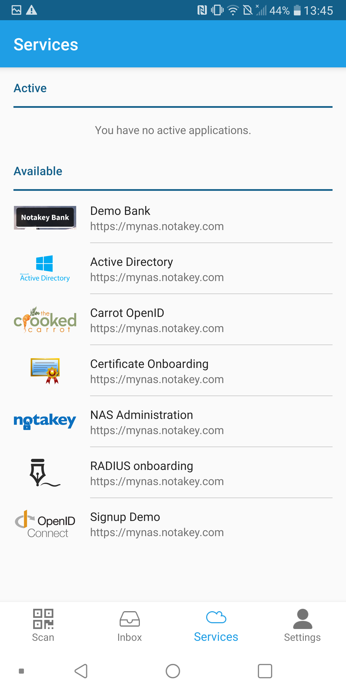
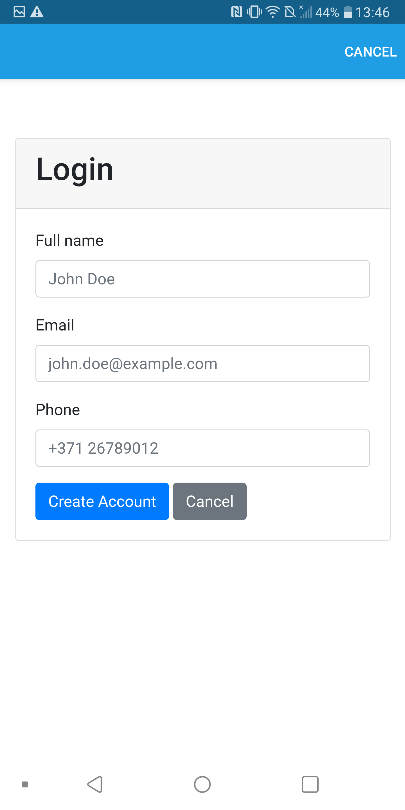
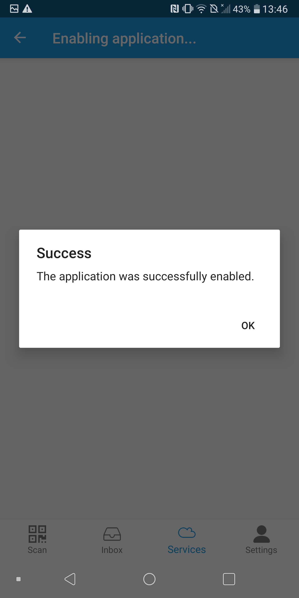
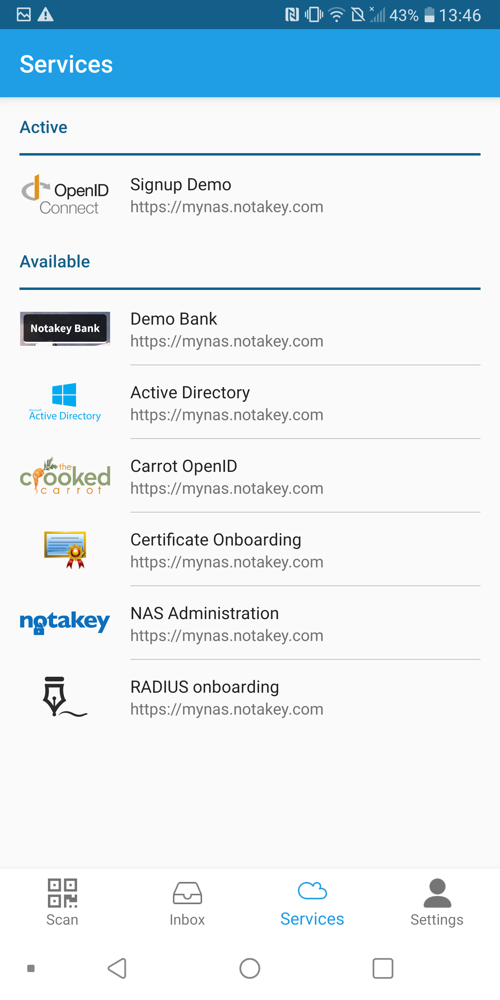
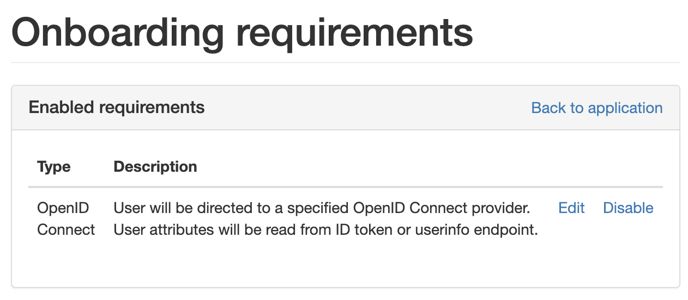
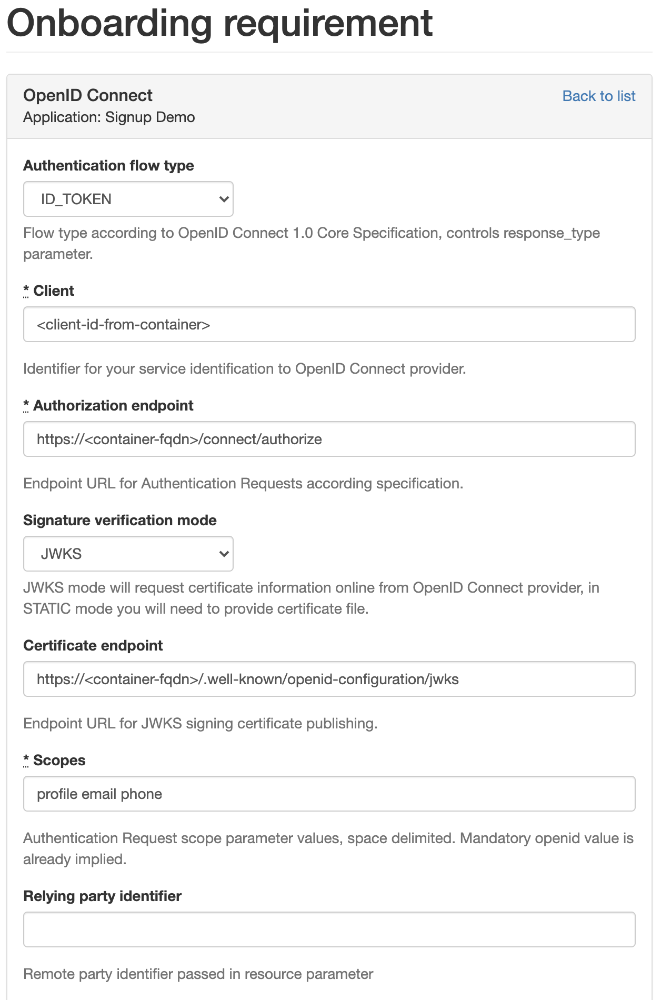

# Notakey Custom Onboarding Example

This project shows how you can add custom onboarding flow to your Notakey Authenticator service using OpenID Connect protocol. This example allows users to self register providing email and mobile phone number. This information can be later used to verify user identity with "Phone Number" or other onboarding requirement.

|                          |                           |                           |                          |
:-------------------------:|:-------------------------:|:-------------------------:|:-------------------------:
   |   |   |  

## Getting Started

* Create Notakey Autehenticator service and configure onboarding requirements using management dashboard as shown below.

    <!-- {:width="200px"} -->

    
    <!-- {:width="200px"} -->

    Claim mapping has to be configured like this `username=sub full_name=name email=email main_phone_number=phone`. This will take attributes from ID token and create or update existing user.

* Clone this repo and build image with `docker build ./ -t mybuiltimage`

* Run image

    ```shell
    docker run -it --rm \
    -p 5000:5000 \
    --name my-custom-onboarding-provider \
    -e OIDC_CLIENT_ID=test-client-id \
    -e OIDC_CLIENT_SECRET=superSecretPass \
    -e OIDC_CLIENT_REDIRECT_URI=https://<ntkas-api-url>/applications/<service-id>/onboarding_requirements/OpenidOnboardingRequirement/openid_connect/callback \
    mybuiltimage
    ```

    This container image is expected to be published behind reverse proxy with valid qualified HTTPS TLS certificate. Certificate can also be provided to container directly as explained below and published ports will need to be adjusted. Endpoints with invalid certificate cannot be opened in Notakey Authenticator app.

    ### Mandatory params

    OIDC_CLIENT_ID - random client ID string that will be used to register this identity provider service in Notakey service onboarding requirement.

    OIDC_CLIENT_SECRET - random client secret string that will be used to register this identity provider service in Notakey service onboarding requirement.

    OIDC_CLIENT_REDIRECT_URI - redirect URI of Notakey service onboarding requirement, \<ntkas-api-url\> is FQDN you have configured for Notakey Authentication Server, \<service-id\> identifies service  to bind this client application to in your domain, can be found in service settings in management dashboard.

    ### Additional params

    OIDC_KEYPAIR_PFX_FILE - path inside container to identity assertion signature keypair keystore (this certificate is used to validate issued token).

    OIDC_KEYPAIR_PASS - password for keystore file above.

    ASPNETCORE_Kestrel__Certificates__Default__Path - path inside container to HTTP TLS keystore (this certificate is used for web server https endpoint).

    ASPNETCORE_Kestrel__Certificates__Default__Password - password for keystore file above.

    ASPNETCORE_URLS - listen port definition for web server, use `ASPNETCORE_URLS=https://0.0.0.0:443` to publish container directly with certificate above.


* Try out onboarding by selecting service in Notakey Authenticator app Services tab.

## Getting Help

https://documentation.notakey.com/

https://support.notakey.com/

https://github.com/IdentityServer/IdentityServer4